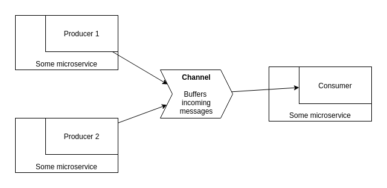

# Working with messaging queues (RabbitMQ)

Messaging queues are an important component of modern-day microservice architectures.

This simple example application demonstrates the core working of a simple messaging queue:
* Two producers push messages into a 'queue' to the RabbitMQ server. These messages can come at any time, and both producers can produce and push messages completely independent of each other.
* The consumer listens to the queue, and performs some task with the messages one by one. The consumer is never overburdened by an overload of incoming requests/messages, and only handles one at a time: the burden of handling incoming data at high rates is completely taken by the messaging queue.

Messaging queues are, IMO, a perfect option for worker processes, which need to evaluate and make use of some data in an asynchronous way. Producers push data into the MQ as it is produced, and the worker, a consumer, picks up messages as they come and performs necessary work on them.

